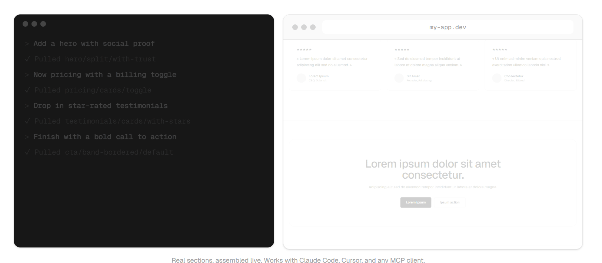

# rifframe-skill

Give your coding agent a design system. 250+ website sections over MCP, one token contract, clean Tailwind out.



[Rifframe](https://rifframe.app) is a catalog of 250+ website sections (hero,
pricing, testimonials, FAQ, features, contact, footer, 30+ types). They share one
set of design tokens, so your agent can pull any combination and it stays
consistent: neutral by default, restyled to any brand by overriding a few CSS
variables. Output is plain Tailwind v4 HTML, no JS, no dependencies.

This repo is a skill that teaches your coding agent how to use Rifframe.

## Install

The integration is an MCP server. One endpoint, any MCP client (Streamable
HTTP, no API key during the beta):

```
https://rifframe.app/api/mcp
```

**Claude Code**

```
claude mcp add --transport http rifframe https://rifframe.app/api/mcp
```

**Codex** — `~/.codex/config.toml`

```toml
[mcp_servers.rifframe]
url = "https://rifframe.app/api/mcp"
```

**Cursor** — `.cursor/mcp.json` (same JSON for Windsurf, Cline and most clients)

```json
{ "mcpServers": { "rifframe": { "url": "https://rifframe.app/api/mcp" } } }
```

**VS Code** — `.vscode/mcp.json`

```json
{ "servers": { "rifframe": { "type": "http", "url": "https://rifframe.app/api/mcp" } } }
```

Any other MCP client: point it at the endpoint above. Plain HTTP also works —
the same catalog is a REST API at `https://rifframe.app/api/v1/sections`.

### Claude Code skill (optional)

[`SKILL.md`](./SKILL.md) teaches Claude Code how to search, pull and fill
sections. Drop it into `.claude/skills/rifframe/SKILL.md`. It is a Claude-only
convenience: other clients just connect the MCP endpoint above and prompt the
agent directly.

## Example

> "Build a landing page for a coffee subscription. Use Rifframe: install the
> tokens, then pull a hero, a features grid, pricing with a toggle, testimonials
> and a footer, and write the copy."

The agent searches by intent, pulls clean Tailwind HTML for each section, and
fills the copy. Every section ends up on-brand and consistent with the others.

## What's behind it

The sections, live previews, the AI copy editor and billing live at
[rifframe.app](https://rifframe.app). This skill is the entry point for agents;
the catalog stays served by the API, so there is nothing to keep updated here.

## License

MIT for this skill. The Rifframe catalog is served by the API and is not
redistributed in this repository.
